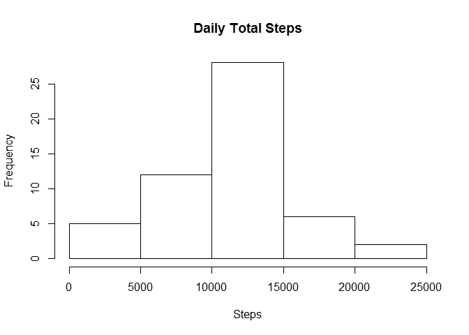
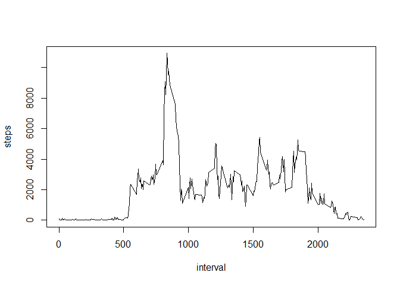
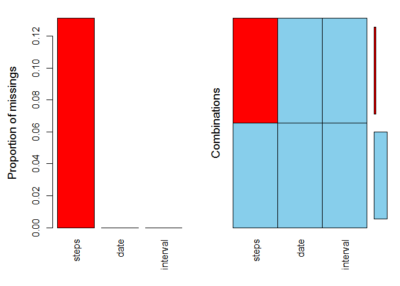
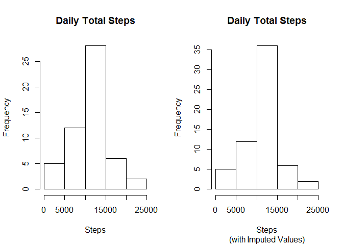
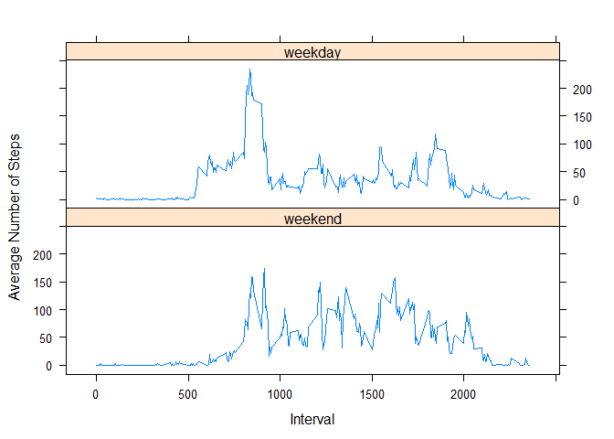

# Reproducible Research: Peer Assessment 1
## Introduction

It is now possible to collect a large amount of data about personal movement using activity monitoring devices such as a Fitbit, Nike Fuelband, or Jawbone Up. These type of devices are part of the "quantified self" movement -- a group of enthusiasts who take measurements about themselves regularly to improve their health, to find patterns in their behavior, or because they are tech geeks. But these data remain under-utilized both because the raw data are hard to obtain and there is a lack of statistical methods and software for processing and interpreting the data.

This assignment makes use of data from a personal activity monitoring device. This device collects data at 5 minute intervals through out the day. The data consists of two months of data from an anonymous individual collected during the months of October and November, 2012 and include the number of steps taken in 5 minute intervals each day.

## Loading and preprocessing the data
The required libraries for graphing and date functions are loaded. Data is read in with the column types set to the right data types to reduce further processing


```r
library(lubridate)
library(lattice)
library(VIM, warn.conflicts = FALSE,  quietly = TRUE, verbose = FALSE)
```

```
## 
## Attaching package: 'data.table'
## 
## The following objects are masked from 'package:lubridate':
## 
##     hour, mday, month, quarter, wday, week, yday, year
## 
## VIM is ready to use. 
##  Since version 4.0.0 the GUI is in its own package VIMGUI.
## 
##           Please use the package to use the new (and old) GUI.
## 
## Suggestions and bug-reports can be submitted at: https://github.com/alexkowa/VIM/issues
```

```r
library(dplyr, warn.conflicts = FALSE,  quietly = TRUE)
activity <- read.csv('activity.csv',header = TRUE, sep = ',', na.strings ='NA', colClasses=c('integer', 'Date','integer'))
```

The structure of the data is as follows


```r
str(activity)
```

```
## 'data.frame':	17568 obs. of  3 variables:
##  $ steps   : int  NA NA NA NA NA NA NA NA NA NA ...
##  $ date    : Date, format: "2012-10-01" "2012-10-01" ...
##  $ interval: int  0 5 10 15 20 25 30 35 40 45 ...
```

```r
summary(activity)
```

```
##      steps             date               interval     
##  Min.   :  0.00   Min.   :2012-10-01   Min.   :   0.0  
##  1st Qu.:  0.00   1st Qu.:2012-10-16   1st Qu.: 588.8  
##  Median :  0.00   Median :2012-10-31   Median :1177.5  
##  Mean   : 37.38   Mean   :2012-10-31   Mean   :1177.5  
##  3rd Qu.: 12.00   3rd Qu.:2012-11-15   3rd Qu.:1766.2  
##  Max.   :806.00   Max.   :2012-11-30   Max.   :2355.0  
##  NA's   :2304
```

Notice that there are roughly 13% of the observations that are missing

## What is mean total number of steps taken per day?

```r
day_tot <- aggregate(steps ~ date, data = activity, sum, na.action = na.omit)
hist(day_tot$steps, main = 'Daily Total Steps', xlab = 'Steps')
```

 

```r
summary(day_tot$steps)
```

```
##    Min. 1st Qu.  Median    Mean 3rd Qu.    Max. 
##      41    8841   10760   10770   13290   21190
```

During the observation period, the minimum total number of steps on a daily basis is 41, while the maximum is 21190 with the mean as 10770.
You also had around 28 days where the number of steps were between the mean and the 3rd quartile

## What is the average daily activity pattern?
The average daily activty pattern is plotted below and it shows the peak activity during the time intervals of roughly 8:00 - 9:30, possibly people getting into work with the highest activity at the 8:35 interval.


```r
int_avg <- aggregate(steps ~ interval, data = activity, mean, na.action = na.omit)
with(int_avg, plot(interval, steps, type = 'l'))
```

 

## Imputing missing values
Notice that there are roughly 13% of the observations missing in the column *steps*


```r
aggr(activity)
```

 

I have taken the mean of the observations over the intervals and used the rounded values to impute the values for the missing observations. Then drawn the plots to show that there is not a significant difference between the original data set and the one with imputed values 


```r
int_mean <- aggregate(steps ~ interval, data = activity, mean , na.action = na.omit)
na_act <- activity[which(is.na(activity$steps)),]
valid_act <- activity[which(!is.na(activity$steps)),]
#merge the values with the mean for the interval
y <- merge(na_act, int_mean, by.x = 'interval', by.y = 'interval')
#have the proper columns to row bind
y <- y [,c(4,3,1)]
#Provide the correct column names
colnames(y) <- colnames(activity)
y$steps <- round(y$steps,0)
new_act = rbind(valid_act, y)
new_act <- arrange(new_act, date, interval)
#plot the histogram for the total number of steps per day to see if there is a difference
n_day_tot <- aggregate(steps ~ date, data = new_act, sum)
par(mfrow = c(1,2))
hist(day_tot$steps, main = 'Daily Total Steps', xlab = 'Steps')
hist(n_day_tot$steps, main = 'Daily Total Steps', sub= '(with Imputed Values)', xlab = 'Steps')
```

 

```r
summary(new_act$steps)
```

```
##    Min. 1st Qu.  Median    Mean 3rd Qu.    Max. 
##    0.00    0.00    0.00   37.38   27.00  806.00
```
Notice that the imputed values have not had a impact on the plots.
The new mean and median of 0.00 and 37.38 are close to the old values

## Are there differences in activity patterns between weekdays and weekends?
The last analysis on the data is done to see if the day of the week impacts the activity pattern. Based on the plots shown below, there is more activity on the weekends during the day - reflecting increased activity around chores or leisure


```r
# create a variable for the day type weekend or weekday
valid_act$daytype <- factor(ifelse(wday(valid_act$date) == 1 | 
                     wday(valid_act$date) == 7, 1,2), levels = c(1,2),
                     labels = c('weekend','weekday'))

#get the average number of steps by day
#get the mean of the  steps per interval by the day type
avg_daytyp <- aggregate(valid_act$steps, by = list(valid_act$interval, valid_act$daytype), mean)
colnames(avg_daytyp) <- c('interval','daytype','steps')
#draw the panel plot
xyplot(steps~interval | daytype , avg_daytyp, 
       ylab = 'Average Number of Steps', xlab = 'Interval',
       layout = c(1,2), type = 'l')
```

 
